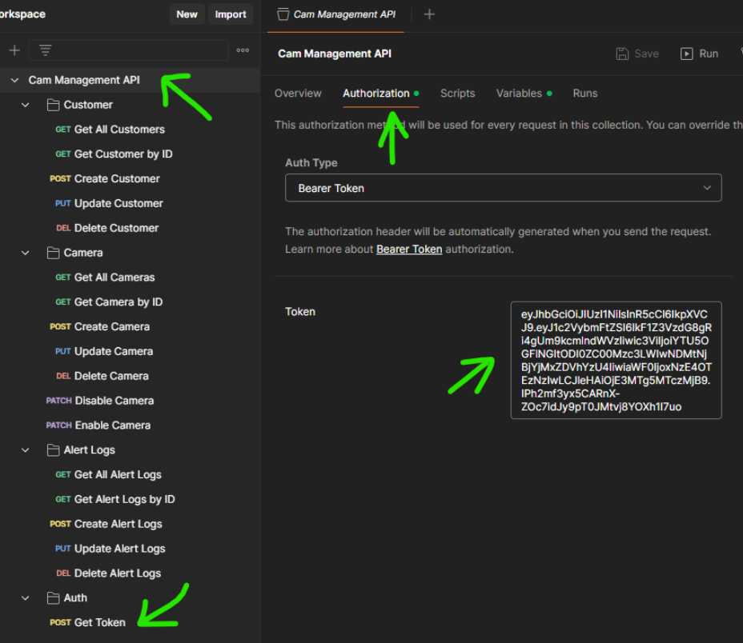
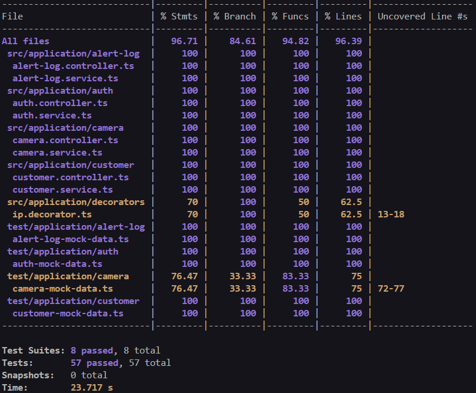

<p align="center">
  <a href="http://nestjs.com/" target="blank"></a>
</p>

[circleci-image]: https://img.shields.io/circleci/build/github/nestjs/nest/master?token=abc123def456
[circleci-url]: https://circleci.com/gh/nestjs/nest

  <p align="center"><strong>API web, utilizando o padrão REST, para gerenciamento de câmeras</strong></p>
    <p align="center">
<a href="https://www.npmjs.com/~nestjscore" target="_blank"></a>
<a href="https://www.npmjs.com/~nestjscore" target="_blank"></a>
<a href="https://circleci.com/gh/nestjs/nest" target="_blank"></a>
<a href="https://coveralls.io/github/nestjs/nest?branch=master" target="_blank"></a>
</p>

## Índice

- [Observações Importante (não deixe de ler)](#observações-importantes-não-deixe-de-ler)
- [Pré-requisitos](#pré-requisitos)
- [Setup (com Docker)](#setup-com-docker)
- [Testes Unitários](#testes-unitários)
- [Scripts de execução padrão](#scripts-de-execução-padrão)

## Observações Importantes (não deixe de ler)

README principal (esse que está lendo agora) dedicado para instruções de setup, para conferir as regras de negócio, formas de utilização e informações gerais sobre o projeto conferir o DESAFIO.md que está nesse mesmo repositório.<br/>

Para um setup mais ágil da aplicação utilize o Docker, no [Setup](#setup-com-docker) é explicado como<br/>

Variáveis de ambiente (arquivo .env) <strong>não</strong> estão no .gitignore para <strong>facilitar</strong> o setup da aplicação, há um comentário no topo do arquivo .env

Importar a coleção do Postman que está no root do projeto para já ter todos os endpoints

<strong>Os endpoints precisam de autenticação, gerar token no endpoint /auth com o 'name' de algum customer e colocar no diretório principal do Postman para que todos os métodos o tenham por herança</strong>



## Pré-requisitos

Certifique-se de ter o Node.js, npm instalados e para um setup mais ágil o Docker.

## Setup (Com Docker)

Faça o clone do repositório:
```cmd
git clone https://github.com/augusto-f-rodrigues/cam-management.git
cd cam-management
```

Com o docker <strong>aberto</strong> execute o comando:
```cmd
docker compose up
```

<strong>É NORMAL<strong/> e esperado que após o build do comando acima aparecer essas mensagens de erro pois ainda vamos configurar o server no pgAdmin: <br/><br/>


Após finalizar o processo de build acesse em seu navegador:<br/>
<a>localhost:5050</a> <br/>

Faça o login no pgAdmin com as informações abaixo:<br/>
email: admin@admin.com <br/>
senha: pgadmin4

No pgAdmin, aperte com o botão direito em 'Servers' que se encontra no canto superior esquerdo e selecione 'Register'>'Server...'<br/>


<strong>Configure exatamente como está abaixo:</strong><br/>

Aba 'General':<br/>
Name: postgres<br/>

Aba 'Connection':<br/>
Host name/address: db <strong>(sim, somente escreva db)</strong><br/> 
Port: 5432<br/>
Maintenance database: postgres<br/>
Username: postgres<br/>
Password: postgres<br/>

Apertar em <strong>Save</strong>

Agora no terminal onde está executando o docker compose, aperte Ctrl + C para finalizar a execução e execute o comando:

```cmd
docker compose up --build
```

Ao finalizar o build a aplicação está pronta para ser testada

<strong>OBS:</strong> Importe em seu Postman a coleção que está no root desse o projeto, nele você encontrará todos os endpoints prontos para serem utilizados

## Testes Unitários

O projeto conta com testes unitários, a foto abaixo é sobre o estado de cobertura atual:



Scripts disponíveis sobre os testes:

```bash
# Rodar os testes unitários
$ npm run test

# Rodar os testes unitários mostrando a cobertura (como no print screen acima)
$ npm run test:cov
```

## Scripts de execução padrão

```bash
# development
$ npm run start

# watch mode
$ npm run start:dev

# production mode
$ npm run start:prod
```
